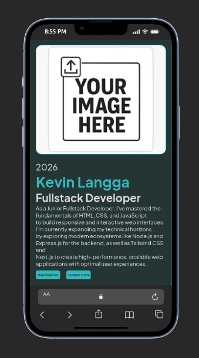
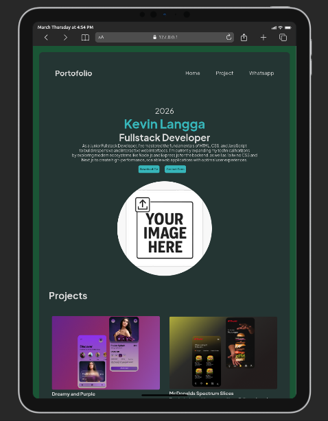
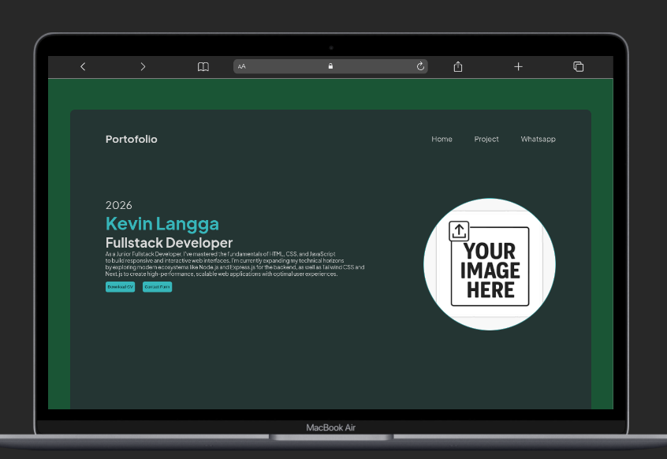

# Personal Portofolio - Kevin Langga

---

> 26 March 2026

## Overview 
This is my first professional project, the main focus on this section is to build personal identity and experience
industry. This website designed with clean,structured, and semantic hierarcy. Adding some break point on CSS to make this porto responsive.

----

## Technologies used

- HTML5
- CSS3
- FIGMA (make the design before execute it to the code)
- GOOGLE FONTS 

---- 

### Breakpoint for Responsiveness

| Breakpoint | Device |
| ---- | ---- | 
| Max-Width: 575.98px | Mobile |
| Max-Width: 1023px | Tablet |
| Min-Width: 1024px | Desktop |

### Screenshot of Responsiveness 

==Mobile Device==

==Tablet Device==

==Desktop Device==

