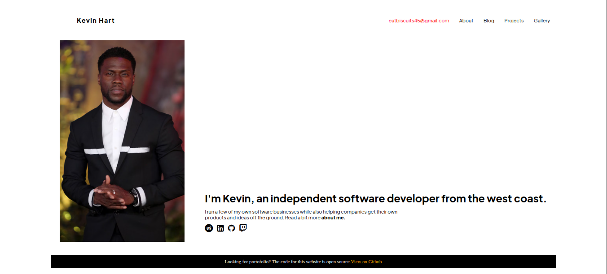
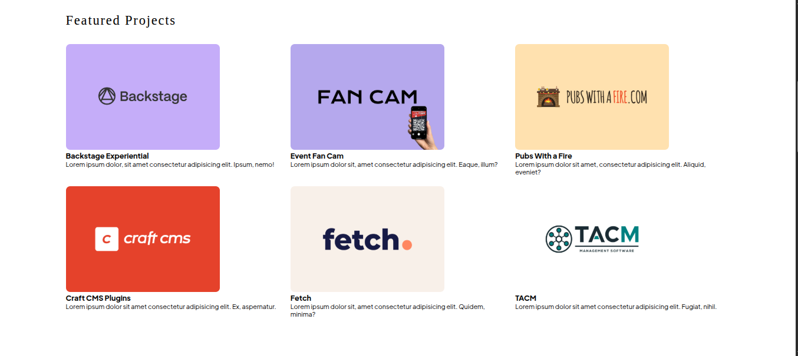

# Example of personal portofolio - *Kevin Hart*

> 05-03-2026

## Overview 

This website is the **example** of how you showing your own profesional independent *software developer* portofolio.
The main focus of this project is to create a meaningful foundation using **Semantic HTML** rules, so it can makes easy for SEO (Search Engine Optimization)
to recognize our HTML document on every device including smartphone.

--------------------------------------------------------

## Feature Implemented

### List of semantics HTML5
- header
- main
- section
- article
- figure
- footer

### Responsive web design 
Layout adaptive using *Media Queries* to create the comfort zone for smartphone user (max 630px).

### Modern Grid and Flexbox layout 
Implementation dynamic grid system for gallery section and flexbox for all navigation bars.

### Integreted Social icons 
Using Font awesome for quick access to LinkedIn,Github,and all the social media.

---------------------------------------------------------

## Technologies USed 
- HTML5 
- CSS3
- Google Fonts
- Font Awesome

---------------------------------------------------------

## Screenshot Website 

